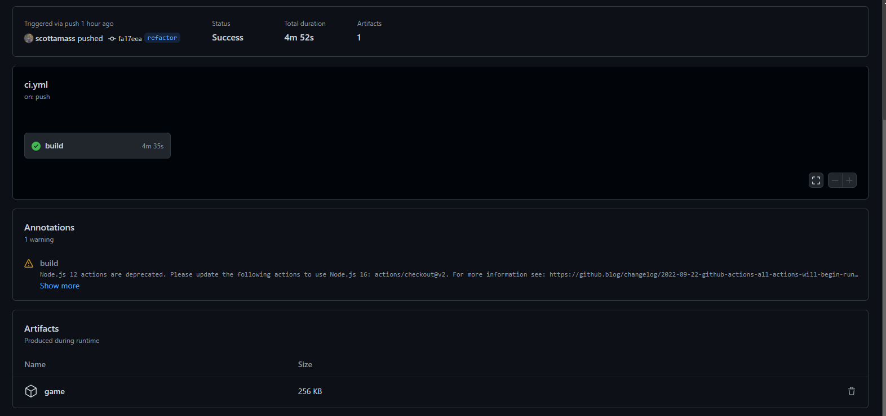

# Gb-Studio Sample Project with build on push 

this is built off the standard gb studio 3 project but when pushed to github an action is triggered to build the rom file. In its current state build are down as an artifact on the github actions page. 



From here you can download your build and it is currently stored as a zip file with game.gb inside 

## What if I want to build for web ?

open the "ci.yml" file in the .github/workflows folder and find the below line of code 

```js
    run: gb-studio-cli make:rom project.gbsproj out/game.gb
```

and change it for this:


```js
    run: gb-studio-cli make:web project.gbsproj out/
```

## Making the project your own

open the "project.gbsproj" in a text editor and the author line the following following code block 

```js
    {
    "name": "sample",
    "author": "scottamass",
    "_version": "3.1.0",
    "_release": "3",
    "scenes": [
        {
```

## Adding the workflow to an existing project

if you have an existing project and you would like to add the workflow simple 
clone the repo and copy the .github folder in to your project root if your ".gbsproj" has a diffrent name you will need to slighlty ammend the "ci.yml" file  see below 

```js
    - name: build the project 
      run: gb-studio-cli make:rom <yourfilenamehere>.gbsproj out/<gamefile>.gb

    - name: Archive production artifacts
      uses: actions/upload-artifact@v3
      with:
        name: game
        path: out/<gamefile>.gb
```


## Future plans 
- I am currenly building a dockerfile that also build as I have found I am able to complie gb-studio builds on my M2 Mac and may switch the script to the docker command to see if this improves build times on the workflow. 

- I am also looking to add a step that will deploy pushes to master/main to itch.io but this is a wip. 

## Issues if you have any Issues
please feel free to open an [Issue](https://github.com/scottamass/sample/issues) on this repo. 

## Thanks 
A special thanks to [Chris Maltby](https://github.com/chrismaltby/gb-studio) and all who have contributed to Gb-studio without this amazing application we would have nothing to build in the firstplace 

